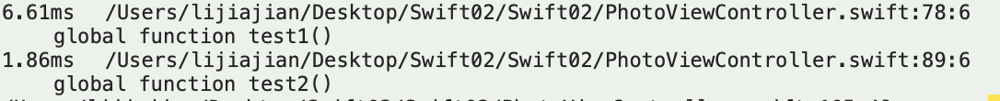
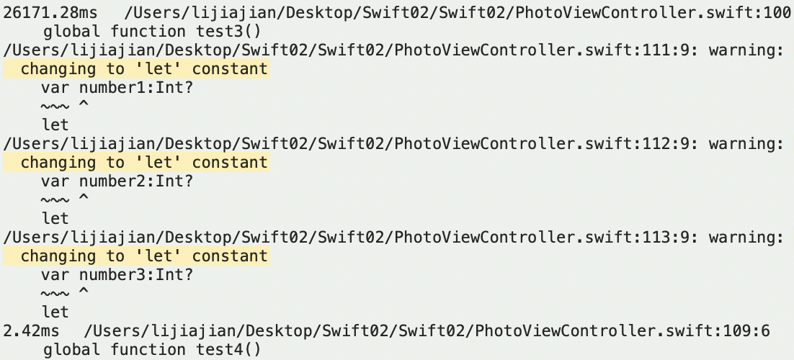
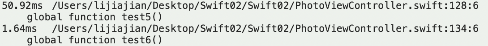

# Swift 笔记 
记录swift学习

## 如何有效提高swift的编译速度

1. 尽量避免类型推断，能确定类型的一定要给出具体类型

```objc
func test1() {
    let number = 32
    let string = ""
    let label = UILabel()
    let dict = ["string1":"string","number":10,"label":label] as [String : Any]
    let strings: [String] = []

    print(number,string,label,dict,strings)
}


func test2() {
    let number:Int = 32
    let string:String = ""
    let label:UILabel = UILabel()
    let dict:[String:Any] = ["string1":"string","number":10,"label":label] as [String : Any]
    let strings: [String] = [String]()

    print(number,string,label,dict,strings)
}
```



2. nil类型问题
由于swift存在可选值，因此某些对象的值可能为空，这在代码处理时可能会导致编译很慢

```objc

func test3() ->Int {
    var number1:Int?
    var number2:Int?
    var number3:Int?
    return 10 + (number1 ?? 0) + (number2 ?? 0) + (number3 ?? 0)
}


func test4() ->Int {
    var total = 10
    var number1:Int?
    var number2:Int?
    var number3:Int?
    if let number1 = number1 {
        total = total + number1
    }

    if let number2 = number2 {
        total = total + number2
    }
    if let number3 = number3 {
        total = total + number3
    }
    return total
}

```



3. +,+=运算
直接看代码

```objc

func test5() {
    var arrays = [Int]()
    let arr1 = [1,2,3]
    let arr2 = [3,4,5]
    arrays += arr1 + arr2 + [10]
}
func test6() {
    var arrays:[Int] = [Int]()
    let arr1 = [1,2,3]
    let arr2 = [3,4,5]
    arrays.append(contentsOf: arr1)
    arrays.append(contentsOf: arr2)
    arrays.append(contentsOf: [10])
}

```



4. 复杂表达式计算
直接看代码